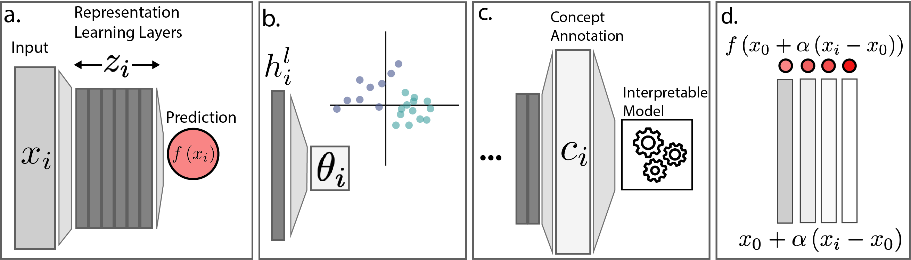

### Interpretability Review



This repository contains code accompanying _Data Science Principles for Interpretable and Explainable AI_. To reproduce the figures in the main text,
you can run these notebooks. None should take longer then 5 minutes to complete.

* `interpretable.Rmd`: Code for the sparse logistic regression and decision tree models on both the raw and featurized versions of microbiome trajectory data. This creates Figure 1 in the text.
* `transformer.ipynb`: Run a transformer on the trajectory data. This trains the model that is analyzed using global embeddings and integrated gradients in the next steps.
* `concept_bottlneck.ipynb`: Run a concept bottleneck model on trajectory data.
* `embeddings.ipynb`: Extract and save the embeddings associated with the trained transformer model.
* `embeddings.Rmd`: Visualize the embeddings saved by `embeddings.ipynb`. This creates Figure 3. 
* `integrated_gradients.ipynb`: Save the integrated gradients for a subset of samples.
* `attributions.Rmd`: Visualize the integrated gradient estimates saved by `integrated_gradients.ipynb`. This creates Figure 4.

### Data and Environment Setup

The data used in the case study are generated in the notebook
`generate/concept.Rmd`. They are also saved in the the [`data`
folder](https://github.com/krisrs1128/interpretability_review/tree/main/data) of
this repository, in case you want to run the modeling and interpretation code
directly.

If you are running this code on your own laptop, you will need to setup your
environment with the following packages:

* R: `LaplacesDemon`, `ggrepel`, `glmnetUtils`, `glue`, `gsignal`, `patchwork`, `scico`, `sparsepca`, `tidyverse`
* python: `captum` `lightning`, `numpy`, `pandas`, `tensorboard`, `torch`, `transformer`, 

In R, you can install these packages from CRAN:
```
pkgs <- c("LaplacesDemon", "ggrepel", "glmnetUtils", "glue", "gsignal", "patchwork", "scico", "sparsepca", "tidyverse")
install.packages(pkgs)
```

For python, you can create a conda environment with these packages:

```
conda create -n interpretability python=3.12
conda activate interpretability

conda install -y conda-forge::lightning
conda install -y conda-forge::pandas
conda install -y conda-forge::tensorboard
conda install -y conda-forge::transformers
conda install -y pytorch::captum
```

All python notebooks are assumed to be run from folder they are saved in, while
the R notebooks are assumed to be run with the repository root
(`interpretability_review`) as the working directory.

### Contact

If you have any questions, don't hesitate to create an issue or reach out to
[ksankaran@wisc.edu](mailto:ksankaran@wisc.edu)
